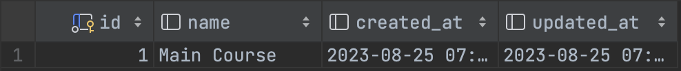

# Deskripsi
Aplikasi ini dibuat menggunakan bahasa pemrograman Golang dan database PostgreSQL

# Instalasi

- Clone repository
- Copy file `.env.example` menjadi `.env`
- Sesuaikan konfigurasi database pada file `.env`
- Jalankan perintah `go mod tidy` untuk mendownload library yang dibutuhkan
- Docker
  - masuk ke direktori aplikasi
  - jangan lupa create network `docker network create mre` (menyesuaikan nama network)
  - jalankan perintah `docker-compose build`
  - kemudian jalankan perintah `docker-compose up -d`
  - app diexpose ke port `:8080`
  - database diexpose ke port `:5433`
- Manual
  - masuk ke direktori aplikasi
  - jalankan perintah `go run .`

 

# Struktur database (ERD dan/atau Table Relationship)

 

- Struktur database

 

 

- ERD

 

 

# Postman

 

 

# Endpoint Master Bahan (Ingredient) & Kategori (Category)

 

1. <b>Ingredient</b>

  - [GET] `/api/get_ingredients` - Get all
  - [POST] `/api/create_ingredient` - Create
  - [GET] `/api/get_ingredient/{id}` - Get by id
  - [PUT] `/api/update_ingredient/{id}` - Update
  - [DELETE] `/api/delete_ingredient/{id}` - Delete

2. <b>Category</b>

  - [GET] `/api/get_categories` - Get all
  - [POST] `/api/create_category` - Create
  - [GET] `/api/get_category/{id}` - Get by id
  - [PUT] `/api/update_category/{id}` - Update
  - [DELETE] `/api/delete_category/{id}` - Delete

 

# Endpoint Data resep dan beserta menampilkan bahan-bahan dan kategori yang digunakan

 

1. <b>Resep</b>

  - [GET] `/api/get_recipes` - Get all
  - [POST] `/api/create_recipe` - Create
  - [GET] `/api/get_recipe/{id}` - Get by id
  - [PUT] `/api/update_recipe/{id}` - Update
  - [DELETE] `/api/delete_recipe/{id}` - Delete

2. <b>Resep Bahan</b>

  - [GET] `/api/get_ingredients` - Get all
  - [POST] `/api/create_ingredient` - Create
  - [GET] `/api/get_ingredient/{id}` - Get by id
  - [PUT] `/api/update_ingredient/{id}` - Update
  - [DELETE] `/api/delete_ingredient/{id}` - Delete

 

# Menampilkan list / index / read resep berdasarkan search / filter 

 

- [GET] `/api/filter_recipeingredient?recipe={id}&ingredient={id}` - Get filter

 

# TEST

 

- run test `go test -v .`

 

# Data
- Bahan 

 

  
 

- Kategori 

 

 

- Resep

 

 

 

- Resep Bahan

 

 
